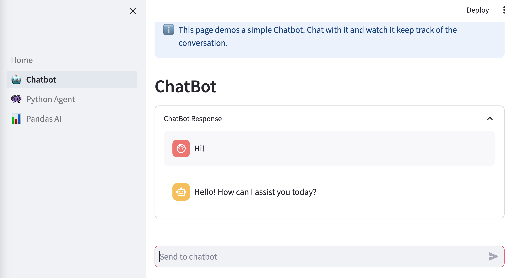

# GenAI Interface Package Template 
Use this cookiecutter to get a GenAI Interface sample repo in under 10 seconds.

The demo includes 3 interfaces:
 - A chatbot
 - A python agent
 - A PandasAI agent



## Usage
```bash
pip install cookiecutter
cookiecutter https://github.com/rodrigo-georgian/genai-interface-cookiecutter
```

## Included
- Package management with Poetry
- pre-commit hooks
- Linting with flake8, black, isort
- Type Checking with mypy
- Tests with pytest, pytest-cov
- CI with Github Actions

## Dependencies
- cookiecutter:
```bash
pip install -r requirements
```

## Tests
```
make test
```
<!-- ### Todo
Add video tutorial
--->
