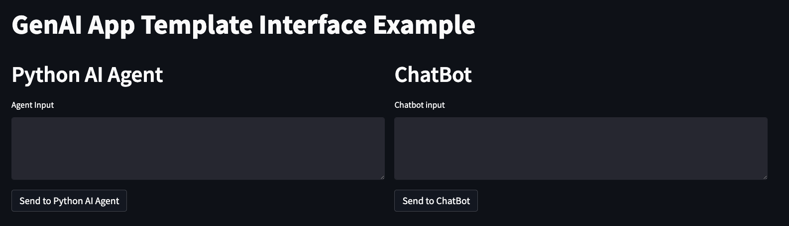
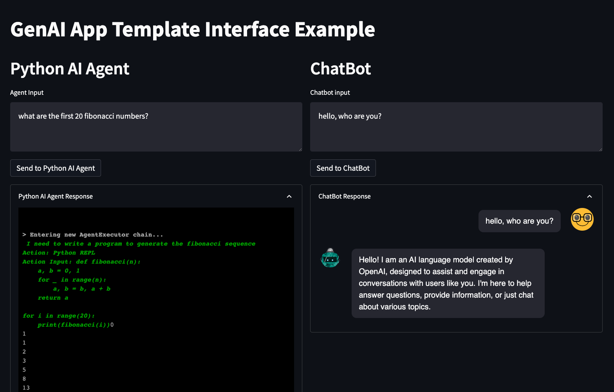
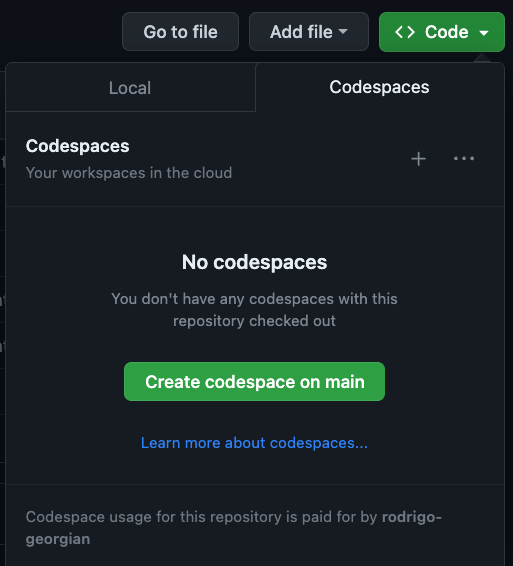

# {{cookiecutter.project_name}}
# Set Up

1. Environment management options
   
    a)  Poetry: ```poetry shell```
    
    b) Conda: create and activate a conda env for this project:
```bash
conda create -n {{cookiecutter.project_slug}} python=3.10
conda activate {{cookiecutter.project_slug}}
```

2. Install package
```
poetry install
```

3. Create private environment file (this will not be committed!)

```
cp .env-template .env
```

Add any necessary API keys to `.env` following the given format.

4. Check installation worked by running 
```
pytest .
```

Note: To pass all tests, an OpenAI API key must be added to `.env`.

# Demos
Run `make demo` to see the main demo interface.
You should see something like:
```
poetry run streamlit run interfaces/Home.py

  You can now view your Streamlit app in your browser.

  Local URL: http://localhost:8000
  Network URL: http://XXX.XXX.X.XX:8000
```
And after clicking the link above, should see something like this:


Here are some example inputs to try!


## Codespaces
To easily share this demo with others, you can use [github codespaces](https://github.com/features/codespaces). To do this:

1. Start a codespace from the github interface:

2. Follow the setup instructions in the VScode terminal (you can skip the conda env).
3. Instead of `make demo`, use `make demo-spaces`
4. Once you have the interface running, you can share it publicly by going to `Ports` in the VScode toolbar, right clicking on the streamlit port and setting `Port Visibility` to public. [More details here](https://docs.github.com/en/codespaces/developing-in-codespaces/forwarding-ports-in-your-codespace).

# Repo Info
## Poetry
We use [poetry](https://python-poetry.org/) as our dependency manager.
The link above has great documentation but there is a TL;DR.

- Install the package: `poetry install`
- Add a dependency: `poetry add <python-lib>`
- Where are dependencies specified? `pyproject.toml` include the high level requirements. The latests exact versions installed are in `poetry.lock`.

## Streamlit
We use [streamlit](https://streamlit.io/) for the interface. 

Streamlit is an open-source Python library that makes it easy to create and share custom web apps for machine learning and data science. 

Here are [the docs](https://docs.streamlit.io/).
